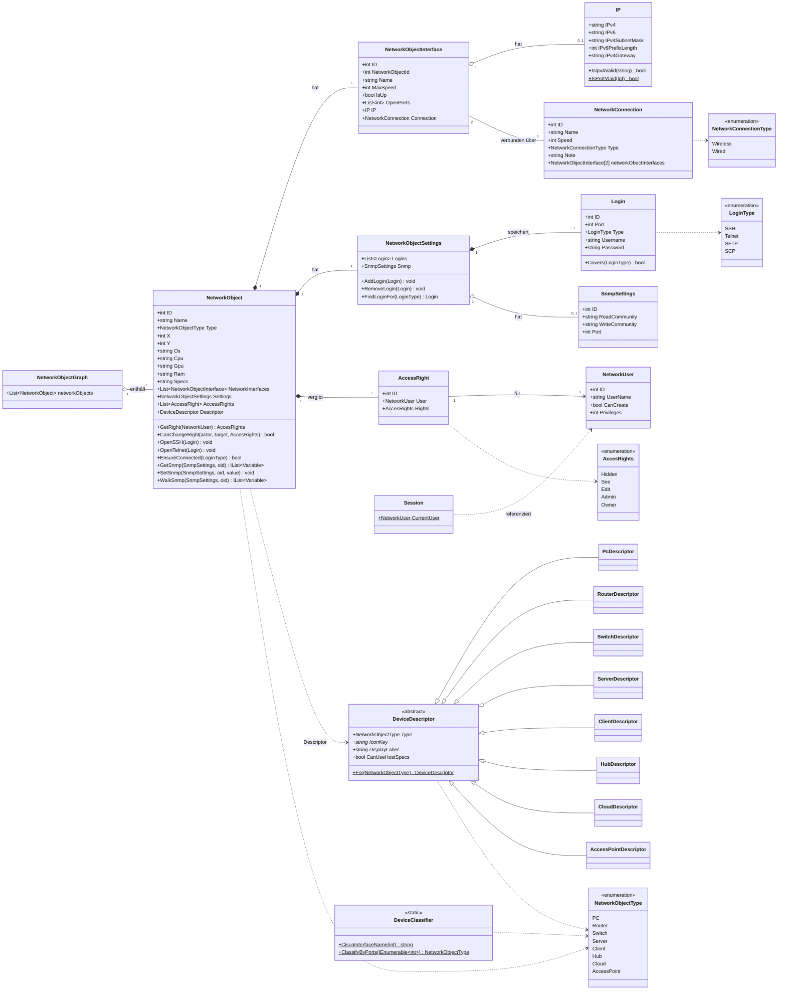

# 🐀 RAT — Klassendiagramm (Logikschicht)

UML-Klassendiagramm der `RAT_Logic`-Schicht (Domänenmodell), gezeichnet mit **Mermaid**.
Spiegelt den **aktuellen** Code-Stand wider (ersetzt die Vorab-Plan-UML aus der Planungsphase).

---

## Überblick

`NetworkObjectGraph` hält die gesamte Topologie. Ein `NetworkObject` (Gerät) besitzt
mehrere `NetworkObjectInterface` (Schnittstellen); je zwei Interfaces werden durch eine
`NetworkConnection` (Kabel/Funkstrecke) verbunden. Pro Gerät gibt es `NetworkObjectSettings`
mit `Login`s und `SnmpSettings` sowie `AccessRight`s, die einem `NetworkUser` eine Rechtestufe
zuordnen. Der Gerätetyp wird über die abstrakte `DeviceDescriptor`-Hierarchie aufgelöst.

---

## Legende

| Symbol | Bedeutung |
|--------|-----------|
| `*--` | Komposition (Teil-Ganzes, Lebensdauer gebunden) |
| `o--` | Aggregation (lose Zugehörigkeit) |
| `-->` | gerichtete Assoziation |
| `..>` | Abhängigkeit / Nutzung |
| `<|--` | Vererbung (Sub- erbt von Superklasse) |
| `$` | statisches Member · `*` | abstraktes Member |

> Hinweis: Querschnittsklassen der Daten- und UI-Schicht (`IDatabaseConnection`,
> `DatabaseConnection`, ViewModels usw.) sind hier bewusst weggelassen — siehe
> [Architektur in der Dokumentation](Dokumentation.md#5-funktionsblöcke-bzw-architektur).
