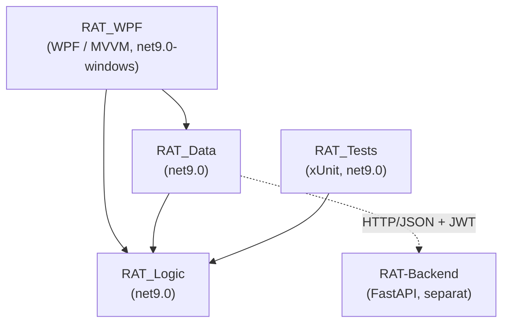
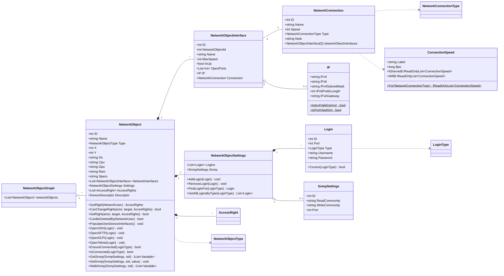
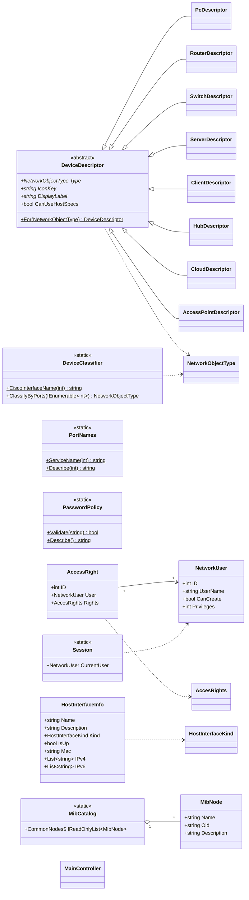
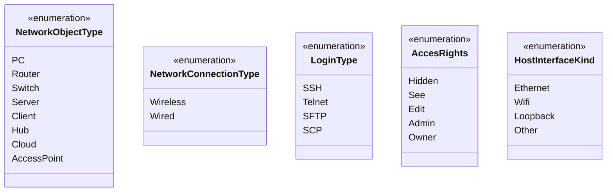
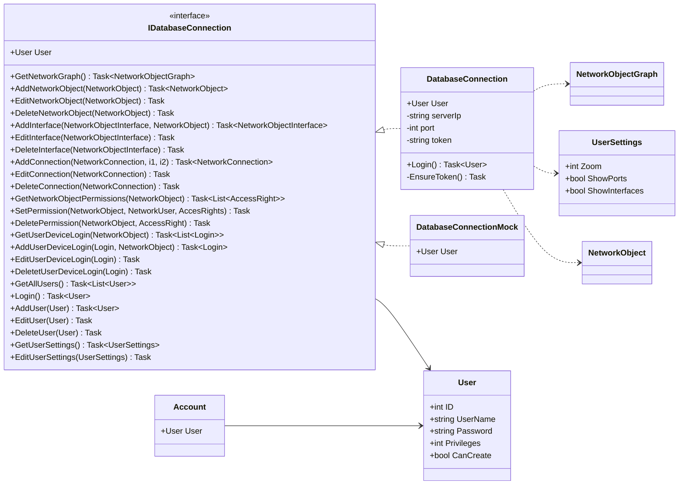
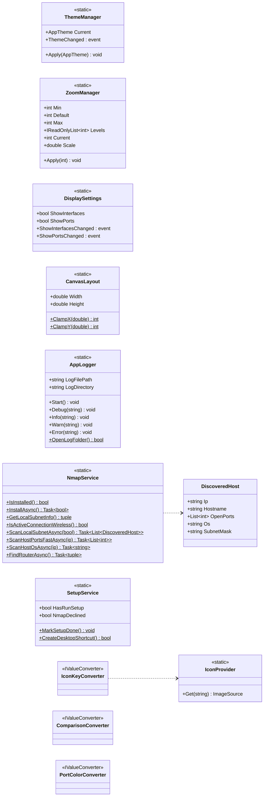
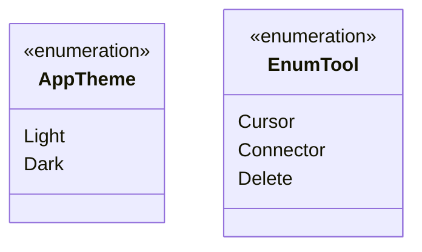
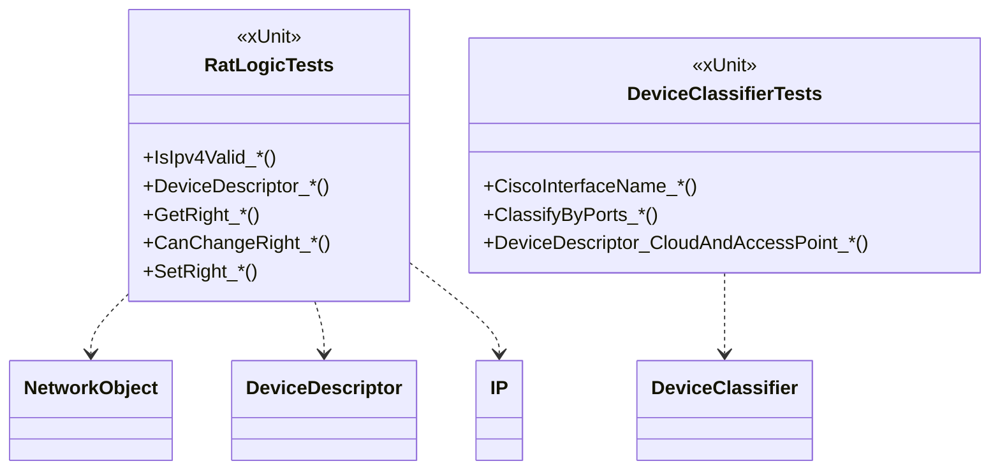

<div align="center">

# 🐀 RAT — UML-Klassendiagramm (gesamtes Projekt)

UML-Klassendiagramme aller Projekte der Solution, gezeichnet mit **Mermaid**.
Spiegelt den **aktuellen** Code-Stand wider (ersetzt die Vorab-Plan-UML aus der Planungsphase).

</div>

---

## Inhalt

1. [Schichten & Projektabhängigkeiten](#1-schichten--projektabhängigkeiten)
2. [RAT_Logic — Domänen- & Logikschicht](#2-rat_logic--domänen--logikschicht)
3. [RAT_Data — Datenschicht](#3-rat_data--datenschicht)
4. [RAT_WPF — Präsentationsschicht (MVVM)](#4-rat_wpf--präsentationsschicht-mvvm)
5. [RAT_Tests — Testschicht](#5-rat_tests--testschicht)
6. [Legende](#6-legende)

---

## 1. Schichten & Projektabhängigkeiten



---

## 2. RAT_Logic — Domänen- & Logikschicht

### 2.1 Topologie-Modell



### 2.2 Gerätetypen, Klassifizierung & Benutzer/Rechte



### 2.3 Enums



---

## 3. RAT_Data — Datenschicht



---

## 4. RAT_WPF — Präsentationsschicht (MVVM)

### 4.1 ViewModels, Commands & Stores

```mermaid
classDiagram
    direction LR

    class ViewModelBase {
        <<abstract>>
        +PropertyChanged : event
        #OnPropertyChanged(name) void
    }
    class CommandBase {
        <<abstract>>
        +CanExecute(object) bool
        +Execute(object) void
        +CanExecuteChanged : event
    }

    class MainViewModel {
        +ViewModelBase CurrentViewModel
    }
    class LoginViewModel {
        +string Username
        +string Password
        +string ServerIp
        +int ServerPort
        +ICommand LoginCommand
        +ICommand LocalOnlyCommand
        +ShowStatus(bool, string) void
    }
    class TopologyViewModel {
        +NetworkObjectListingViewModel defaultItems
        +IEnumerable~NetworkObjectViewModel~ NetworkObjects
        +IEnumerable~NetworkConnectionViewModel~ NetworkConnectionViewModels
        +EnumTool ToolEnum
        +ICommand NetworkObjectAddConnectionCommand
        +ICommand NetworkObjectDeleteCommand
        +ICommand LogoutCommand
        +DiscoverDevicesAsync() Task
        +EnsurePortsScannedAsync() void
        +Logout() void
    }
    class NetworkObjectViewModel {
        +NetworkObject Model
        +string Type
        +string Name
        +int X
        +int Y
        +bool ShowPorts
        +IEnumerable~PortEntry~ Ports
        +ICommand NetworkObjectOpenSettings
        +RefreshPorts() void
    }
    class PortEntry {
        +string Text
        +bool IsUnreachableLogin
    }
    class NetworkConnectionViewModel {
        +NetworkObjectViewModel Source
        +NetworkObjectViewModel Target
        +int xSource
        +int ySource
        +int xTarget
        +int yTarget
        +bool IsWireless
        +DoubleCollection StrokeDashArray
        +bool ShowInterfaceLabels
        +RefreshAfterEdit() void
    }
    class NetworkObjectListingViewModel {
        +ObservableCollection~NetworkObjectViewModel~ NetworkObjects
        +AddNetworkObject(NetworkObject) void
    }
    class SettingsViewModel {
        +IEnumerable~AppTheme~ Themes
        +AppTheme SelectedTheme
        +IEnumerable~int~ ZoomLevels
        +int SelectedZoom
        +ICommand ApplyThemeCommand
    }
    class CanvasViewModel

    ViewModelBase <|-- MainViewModel
    ViewModelBase <|-- LoginViewModel
    ViewModelBase <|-- TopologyViewModel
    ViewModelBase <|-- NetworkObjectViewModel
    ViewModelBase <|-- NetworkConnectionViewModel
    ViewModelBase <|-- SettingsViewModel
    ViewModelBase <|-- CanvasViewModel
    NetworkObjectViewModel +-- PortEntry

    class LoginCommand
    class LocalOnlyCommand
    class LogoutCommand
    class ChangeThemeCommand
    class NetworkObjectAddConnectionCommand
    class NetworkObjectDeleteCommand
    class NetworkObjectAddedCommand
    class NetworkObjectOpenSettingsCommand
    CommandBase <|-- LoginCommand
    CommandBase <|-- LocalOnlyCommand
    CommandBase <|-- LogoutCommand
    CommandBase <|-- ChangeThemeCommand
    CommandBase <|-- NetworkObjectAddConnectionCommand
    CommandBase <|-- NetworkObjectDeleteCommand
    CommandBase <|-- NetworkObjectAddedCommand
    CommandBase <|-- NetworkObjectOpenSettingsCommand

    class NavigationStore {
        +ViewModelBase CurrentViewModel
        +CurrentViewModelChanged : event
    }
    class DatabaseConnectionStore {
        <<static>>
        +IDatabaseConnection Current
        +string LastServerIp
        +int LastServerPort
    }

    MainViewModel --> NavigationStore
    TopologyViewModel --> NavigationStore
    TopologyViewModel "1" o-- "*" NetworkObjectViewModel
    TopologyViewModel "1" o-- "*" NetworkConnectionViewModel
    TopologyViewModel --> NetworkObjectListingViewModel
    NetworkObjectViewModel --> NetworkObject
    NetworkConnectionViewModel --> NetworkConnection
    LoginCommand ..> DatabaseConnectionStore
    TopologyViewModel ..> DatabaseConnectionStore
```

### 4.2 Querschnitt: Themes, Discovery, Setup, Logging, Converter



### 4.3 Enums (WPF)



---

## 5. RAT_Tests — Testschicht



---

## 6. Legende

| Symbol | Bedeutung |
|--------|-----------|
| `*--` | Komposition (Teil-Ganzes, Lebensdauer gebunden) |
| `o--` | Aggregation (lose Zugehörigkeit) |
| `-->` | gerichtete Assoziation |
| `..>` | Abhängigkeit / Nutzung |
| `<|--` | Vererbung (Klasse erbt von Klasse) |
| `<|..` | Implementierung (Klasse implementiert Interface) |
| `+-- ` | verschachtelte (nested) Klasse |
| `$` | statisches Member · `*` (an Member) | abstraktes Member |
| `<<...>>` | Stereotyp (interface, abstract, enumeration, static, IValueConverter, xUnit) |

> Hinweis: Aus Lesbarkeitsgründen sind die Diagramme nach Projekt/Thema aufgeteilt; Typen wie
> `NetworkObject`, `User` oder `IDatabaseConnection` tauchen in mehreren Diagrammen als
> Beziehungsziel auf. Eine Architektur-Übersicht steht in der
> [Dokumentation](Dokumentation.md#5-funktionsblöcke-bzw-architektur).
