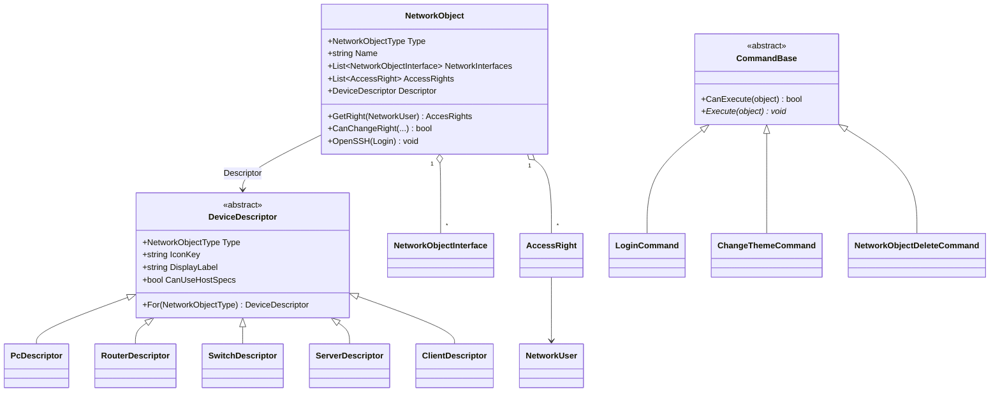

# Generating a class diagram automatically

A few ways to auto-generate a UML class diagram for the RAT client (`src/RATClient`). Pick whichever fits
your toolchain — the Visual Studio Class Designer is the zero-install option; Mermaid/PlantUML produce
diagrams you can commit and render in Markdown.

---

## Option A — Visual Studio "Class Designer" (built-in, no install)

1. Visual Studio Installer → make sure the **Class Designer** individual component is installed
   (under "Individual components" → search "Class Designer").
2. In Solution Explorer, right-click the **`RAT_Logic`** project → **Add → New Item… → Class Diagram**
   (`*.cd`). (Repeat per project; one diagram can only show one project's types directly.)
3. Drag classes from Solution Explorer / Class View onto the surface, or right-click the project →
   **View → View Class Diagram** to drop them all in at once.
4. It auto-draws classes, fields, methods and **inheritance/association arrows** (e.g.
   `PcDescriptor → DeviceDescriptor`, `NetworkObject → DeviceDescriptor`). Export via
   **right-click surface → Export Diagram as Image**.

Good for a quick, accurate picture; the `.cd` file can be committed but only opens in Visual Studio.

---

## Option B — Mermaid `classDiagram` (commit-friendly, renders on GitHub)

Mermaid blocks render directly in GitHub/most Markdown viewers and live next to the code. There's no
official C#→Mermaid extractor, so either hand-write it or generate it (see Option D). A hand-written
snapshot of the abstract hierarchy added in this project:



---

## Option C — PlantUML (richer UML, image export)

PlantUML can read C# and emit a full diagram. Quickest path with no Java setup is the
[C#-to-PlantUML](https://github.com/pierre3/PlantUmlClassDiagramGenerator) global tool:

```powershell
dotnet tool install --global PlantUmlClassDiagramGenerator
# generate one .puml per source file (or a combined one) for the logic project:
puml-gen src\RATClient\RAT_Logic doc\assets\uml\rat_logic -dir -createAssociation
```

Then render the `.puml` with the PlantUML jar, the VS Code "PlantUML" extension, or the public server:

```powershell
# if you have Java + plantuml.jar:
java -jar plantuml.jar doc\assets\uml\rat_logic\*.puml
```

`-createAssociation` draws the association edges (e.g. `NetworkObject → DeviceDescriptor`); inheritance is
detected automatically.

---

## Option D — Roslyn / scripted extraction (fully automatic, CI-friendly)

For a diagram that regenerates from source on every build/CI run, parse the code with **Roslyn**
(`Microsoft.CodeAnalysis.CSharp`): walk each `ClassDeclarationSyntax`, read its base list for
inheritance, and emit Mermaid/PlantUML text. The `PlantUmlClassDiagramGenerator` tool in Option C is
exactly this, pre-built — wire its `puml-gen` call into a build step or a GitHub Action and commit/upload
the output so the diagram never goes stale.

---

### Recommendation
- **One-off / presentation:** Option A (Class Designer) or Option C (PlantUML image).
- **Lives in the repo and renders on GitHub:** Option B (Mermaid), regenerated via Option C/D when the
  model changes.
