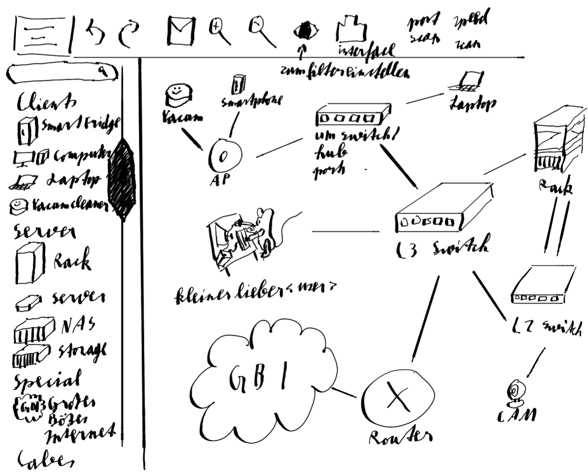
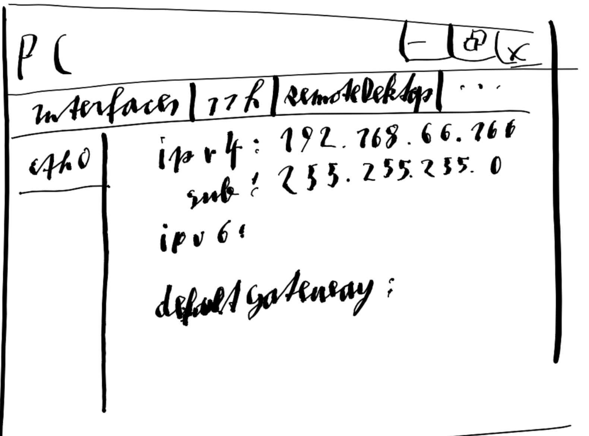
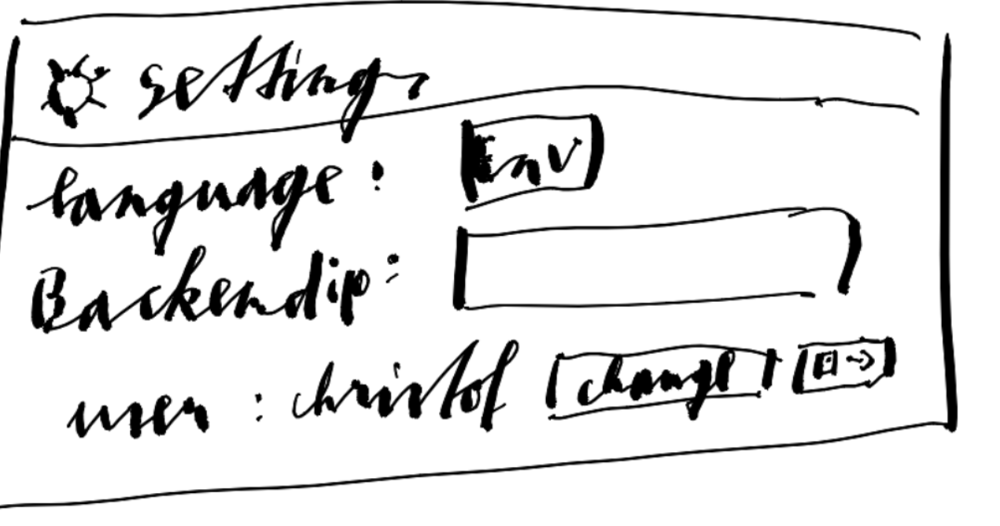
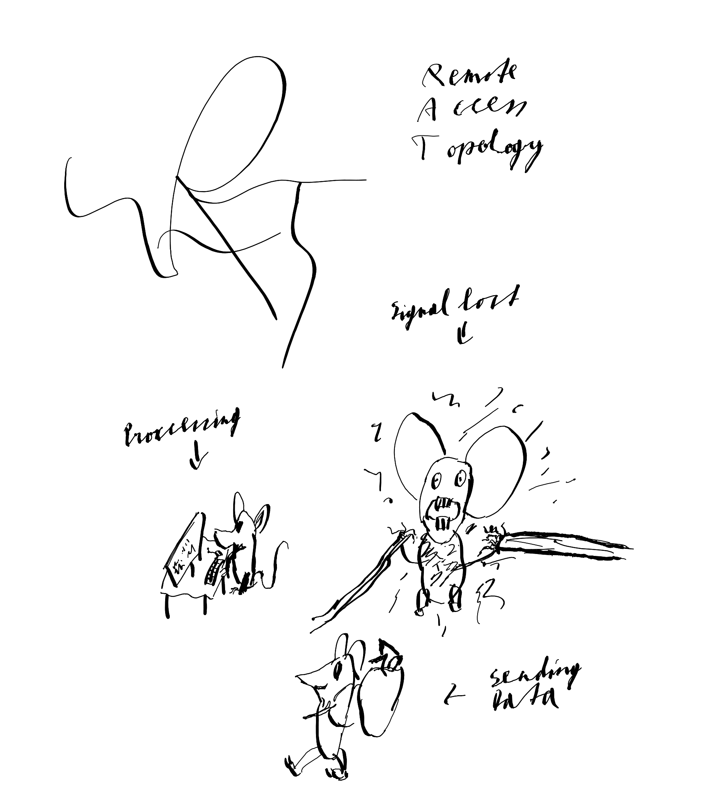
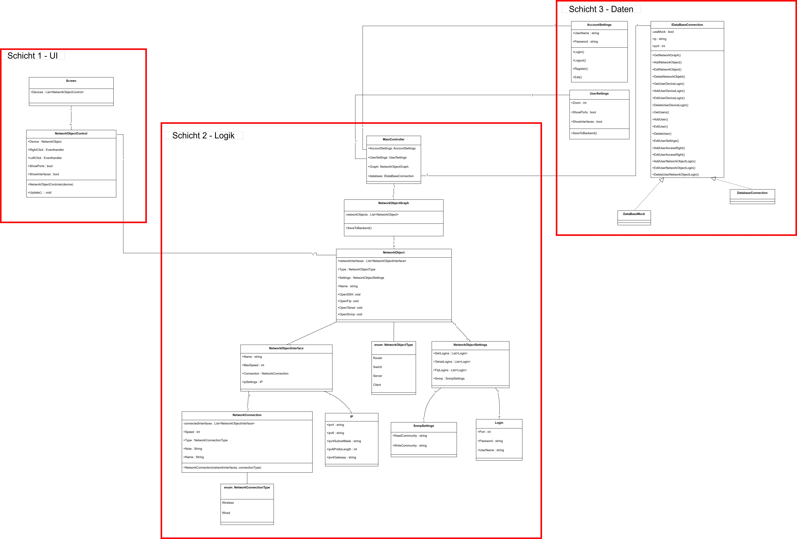
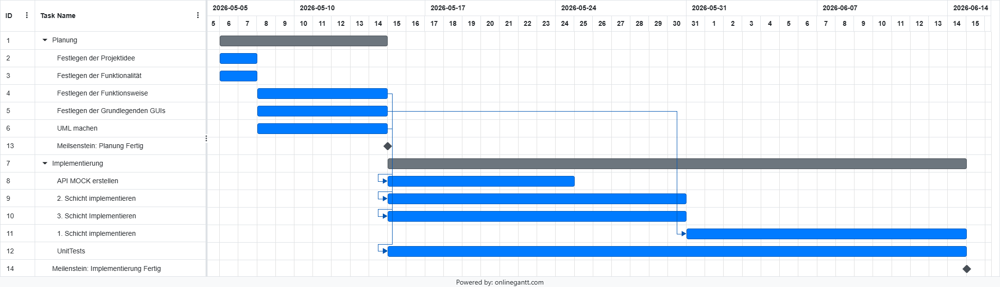

# Projektplanung Schaffer Christof und Reichart Tobias

## GUI Scribbles

### Main Window/Topologie View

### DeviceWindow

Erscheint wenn man auf Gerät doubleclicked

### SettingsWindow

Erscheint beim Burger Menu

Es wird noch mehr Settings und so geben

### IconIdeen

Sketches für Icons (Logo, Processing, Signal lost, Sending data)

## UML Klassendiagramm

## Projektplan

### Projektbeschreibung

Unser Project heißt Remote Access Topology (RAT). Es ist eine Software mit der man Zentral sein eigenes reales Neztwerk überwachen, überprüfen und konfigurieren kann (z.B. duch SNMP). Es sollte so ähnlich aussehen wie Cisco Packet Tracer. Ursprünglich wollten wir auch machen das man per GUI Ports und alles konfigurieren kann, aber der Projektumfang wäre deswegen zu viel für die gegebene Zeit und wir konzentrieren uns erstmal auf Automatische verbindung ber SSH, Telnet und FTP auf Mausclick und SNMP Funktionen.

### Zuständigkeiten

- Tobias
    - Schicht 3
    - Schicht 1
- Christof
    - Schicht 2
        - NetworkObjectGraph und alle Unterklassen
    - Kleine Teile von Schicht 1
- Kooperation
    - MainController

### Milestones und Projektzeitplan

Nur Milestones/Zeitplanung bei POS Teil

Wusste nicht genau bis wann Projektende ist