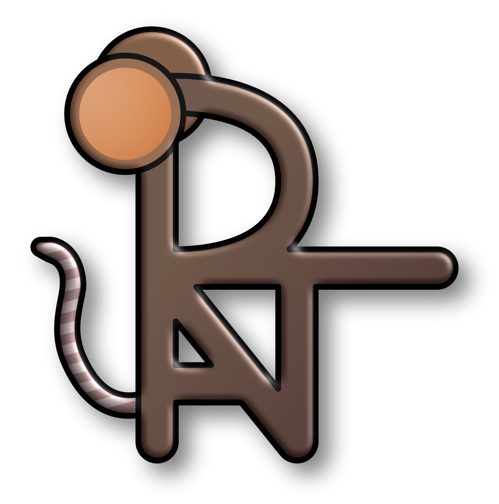
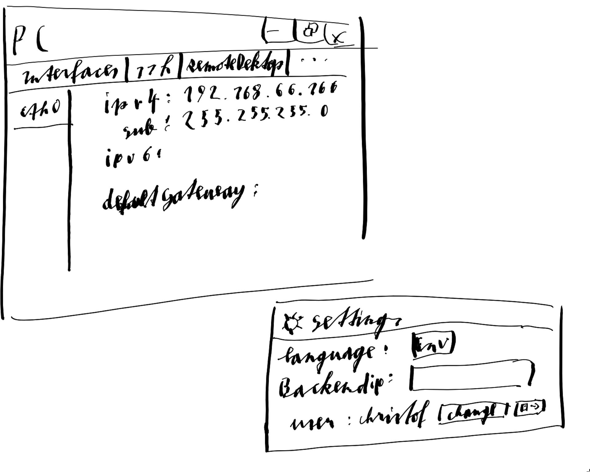

<link rel="stylesheet" href="rats.css">

<p align="center">
  
</p>

# RAT-Backend Documentation

> *"Quick, clever, and always finding a way through."* — the rats theme.

This template demonstrates the **rats** markdown theme. Copy this file as a starting point for new documents, or just add the stylesheet link at the top of an existing one:

```html
<link rel="stylesheet" href="style/rats.css">
```

---

## Headings

### Third level
#### Fourth level

## Text styling

You can write **bold**, *italic*, ***both***, ~~strikethrough~~, and `inline code`. Links look like [this one](https://example.com), and keyboard shortcuts render as <kbd>Ctrl</kbd> + <kbd>S</kbd>.

## Blockquotes

> Rats are remarkably social creatures. They groom each other, play, and even
> laugh when tickled — a high-frequency chirp inaudible to humans.

## Lists

- First scurry
- Second scurry
  - A nested burrow
  - Another tunnel
- Third scurry

1. Sniff
2. Investigate
3. Nibble

## Code block

```sql
SELECT r.name, COUNT(s.id) AS sightings
FROM rats r
LEFT JOIN sightings s ON s.rat_id = r.id
GROUP BY r.name
ORDER BY sightings DESC;
```

## Tables

| Column          | Type         | Description              |
| --------------- | ------------ | ------------------------ |
| `id`            | SERIAL       | Primary key              |
| `name`          | VARCHAR(64)  | Rat's given name         |
| `fur_color`     | VARCHAR(32)  | Brown, black, agouti, …  |
| `last_sighting` | TIMESTAMPTZ  | Most recent appearance   |

---

## Images



---

<p align="center"><sub>RAT-Backend &middot; rats theme</sub></p>
